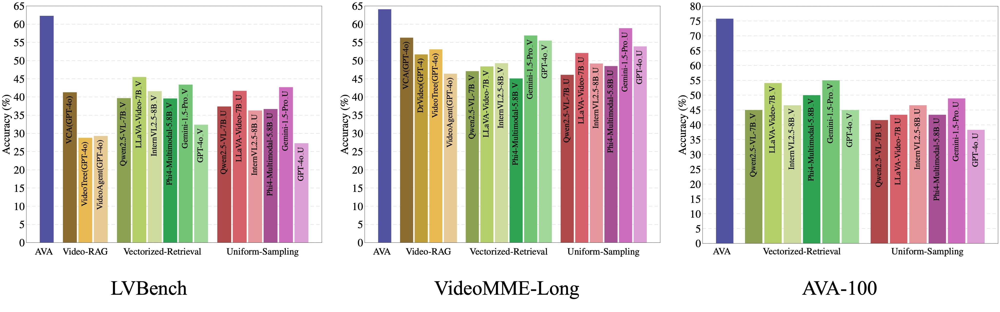
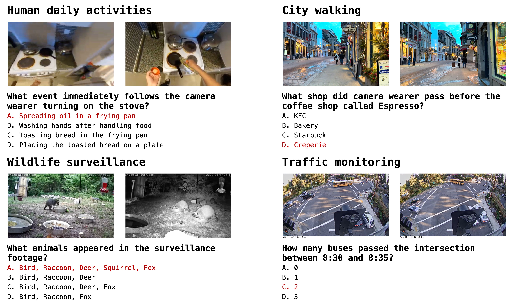

# Project-Ava
An implementation of Paper "Empowering Agentic Video Analytics Systems with Video Language Models"

> 📰 **Paper:**  [Arxiv](https://arxiv.org/abs/2505.00254)
## 🔧 Key Features
- **Task Definition**: Define five levels of intelligence (L1–L5) for current and future video analysis systems. AVA is the first L4 video analytics system powered by VLMs, enabling open-ended comprehension, reasoning, and analytics—marking a significant advancement.
- **Near-real-time index construction**: AVA employs Event-Knowledge Graphs (EKGs) to construct video index, supporting near real-time indexing even on common edge devices (2 $\times$ RTX 4090).
- **Agentic retrieval and generation**: AVA uses LLM as an agent to proactively explore and retrieve additional event information related to prior results, enabling multi-path reasoning and response generation based on aggregated data.
- **Proposed benchmark**: Proposes AVA-100, an ultra-long video benchmark designed to evaluate video analysis capabilities, comprising 8 videos (each over 10 hours) and 120 manually annotated questions across four scenarios: human daily activities, city walking, wildlife surveillance, and traffic monitoring.
- AVA achieves $62.3\%$ on LVBench, $62.3\%$ on VideoMME-Long, and $75.8\%$ on the proposed AVA-100 benchmark, outperforming mainstream VLMs and Video-RAG methods under the same settings.



---
## 📹 AVA-100
Avas-100 is proposed by us, which is an ultra-long video
benchmark specially designed to evaluate video analysis
capabilities Avas-100 consists of 8 videos, each exceeding
10 hours in length, and includes a total of 120 manually
annotated questions. The benchmark covers four typical
video analytics scenarios: human daily activities, city walking, wildlife surveillance, and traffic monitoring, each scenario contains two videos.  All questions are carefully
designed by human annotators, who also provide reference
answers as the ground truth. In addition, GPT-4o is utilized
to generate plausible distractor options.
- **Human daily activities**: Selected and stitched from egocentric footage in the [Ego4D](https://ego4d-data.org/).
- **City walking**: Selected from publicly available YouTube videos, capturing urban exploration.
- **Wildlife surveillance**: Selected from publicly available YouTube videos, capturing animal monitoring.
- **Traffic monitoring**: Selected and stitched from monitoring videos in the [Bellevue Traffic Video Dataset](https://github.com/City-of-Bellevue/TrafficVideoDataset)




---
## 📦 Installation
```bash
git clone https://github.com/I-ESC/Project-AVA.git
cd Project-AVA
conda create -n babel python=3.9
conda activate ava
pip install -r requirements.txt
```

---
## Dataset Preparation
```bash
# supported dataset: LVBench, VideoMME-Long, AVA-100
cd datas/[dataset-name]

# For LVBench and VideoMME-Long
./download.sh

# For AVA-100
mkdir videos
# Then download the videos from Google Drive and place them in the videos folder.
```

---
## Graph Construction
```bash
# View llms.init_model.py for supported models
# View dataset.init_dataset.py for supported dataset
# View datas/[dataset_name]/[dataset_name.json] for video_id, LVBench: 1-103, VideoMME: 601-900, AVA-100: 1-8
python graph_construction.py --model [name_of_model] --dataset [name_of_dataset] --video_id [id_of_video] --gpus [num_of_gpus]

# example
python graph_construction.py --model qwenvl --dataset lvbench --video_id 1 --gpus 1
```

## Generate Summary_and_Answer Result
```bash
# View datas/[dataset_name]/[dataset_name.json] for question_id
python query_SA.py --model [name_of_model] --dataset [name_of_dataset] --video_id [id_of_video] --question_id [id_of_question]--gpus [num_of_gpus]

# example
python query_SA.py --model qwenlm --dataset lvbench --video_id 1 --question_id 0 --gpus 1
```
## Generate Check_raw_frame_and_Answer Result
```bash
# Before generating the CA Result, the corresponding SA Result must have already been produced.
python query_CA.py --model [name_of_model] --dataset [name_of_dataset] --video_id [id_of_video] --question_id [id_of_question]--gpus [num_of_gpus]

# example
python query_CA.py --model qwenvl --dataset lvbench --video_id 1 --question_id 0 --gpus 1
```


## 📄 Citation

If you use this repo, please cite our paper:
```bibtex
@article{ava,
  title={Empowering Agentic Video Analytics Systems with Video Language Models},
  author={Yan, Yuxuan and Jiang, Shiqi and Cao, Ting and Yang, Yifan and Yang, Qianqian and Shu, Yuanchao and Yang, Yuqing and Qiu, Lili},
  journal={arXiv preprint arXiv:2505.00254},
  year={2025}
}
```

